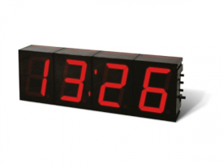

### Opdracht

   

 

We gaan een tekst aanpassen door elk woord in de tekst te laten beginnen met een hoofdletter. Maak dus een programma die de tekst aanpast.

### Invoer

Een tekst.

### Uitvoer

Eén string. In de string is de eerste letter van elk woord een hoofdletter.

### Voorbeeld

**Invoer**
    
    Hopelijk is het morgen mooi weer want de schoolweek eindigt vandaag al.

**Uitvoer**
    
    Hopelijk Is Het Morgen Mooi Weer Want De Schoolweek Eindigt Vandaag Al.
    
     
  
   
