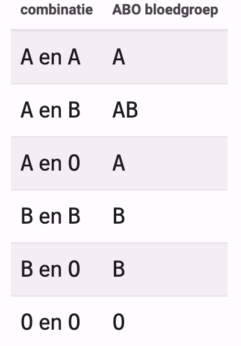

### Opdracht

Bij patiënten die extra bloed nodig hebben is het belangrijk om te weten welke bloedgroep ze bezitten. Er bestaan 3 bloedsoorten die aangeduid worden met A, B of O. Een bloedgroep wordt samengesteld uit 2 bloedsoorten zoals aangegeven in de tabel:

   

 

Shrijf een programma dat op basis van 2 bloedsoorten de juiste bloedgroep weergeeft.

### Invoer

2 bloedsoorten A, B of O op afzonderlijke regels.  

### Uitvoer

Volgende boodschap: "De combinatie van de bloedsoorten *x* en *y* resulteert in bloedgroep *z*.". Waarbij x moet vervangen worden door de 1ste bloedsoort, y door de 2de bloedsoort en z door de juiste bloedgroep.

### Voorbeeld 1

**Invoer**

    B
    A

**Uitvoer**

    De combinatie van de bloedsoorten B en A resulteert in bloedgroep AB.
    
### Voorbeeld 2

**Invoer**

    B
    O

**Uitvoer**

    De combinatie van de bloedsoorten B en O resulteert in bloedgroep B.
