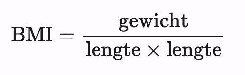
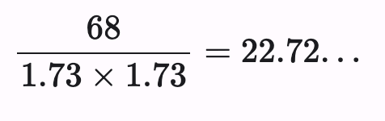
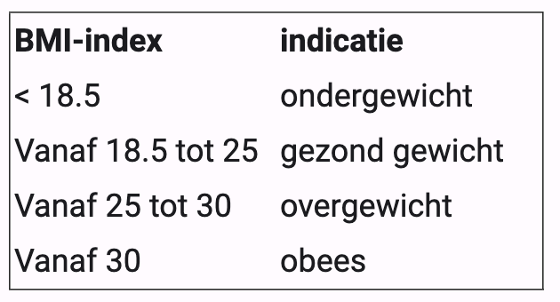

De body-mass index (BMI) is een index die de verhouding tussen lengte en gewicht bij een persoon weergeeft. De BMI-index wordt veel gebruikt om een indicatie te krijgen van overgewicht of ondergewicht. De BMI-index heeft een goede correlatie met de hoeveelheid lichaamsvet.

De BMI-index van een persoon wordt als volgt berekend:
   

 
In deze formule wordt gewicht uitgedrukt in kg en lengte in m.  

> Om het BMI van een persoon van 1.73 m en 68 kg te berekenen maken we volgende berekening:
>   
>

> 
Met behulp van de BMI-index kunnen we een uitspraak doen over het gewicht van een persoon:
   

 
Als je gespierd bent is de body mass index niet zeer betrouwbaar omdat spieren een grotere massadichtheid hebben.

### Opgave

Schrijf een programma dat:

- de lengte en het gewicht van de persoon waarvan de BMI moet berekend worden vraagt aan de gebruiker,
- en ook vraagt of de persoon gespierd is,
- de BMI berekend van de persoon,
- de juiste boodschap afbeeldt rekening houdend met de BMI en de spiermassa van de persoon.

### Invoer

De lengte, gewicht en spiermassa van de persoon. De lengte is een kommagetal uitgedrukt in meter (m), het gewicht is een kommagetal uitegdrukt in kilogram (kg) en de spiermassa wordt weergegeven als "gewoon" of "gespierd".

### Uitvoer

Volgende boodschap:  

gewoon gespierd:

     Je heb een BMI van <berekende waarde> en dus een <indicatie> gewicht. 
     
gespierd en een BMI vanaf 25:

     Je hebt een gespierd lichaam met een BMI van <berekende waarde> maar deze index is niet betrouwbaar voor gespierde personen.
     
Waarbij \<berekende waarde\> vervangen wordt door het resultaat van je berekening afgerond op 1 cijfer na de komma en \<indicatie\> door de juiste indicatie uit de tabel.

### Voorbeelden

**Invoer**

     1.72
     70.0
     gewoon

**Uitvoer**

     Je hebt een BMI van 23,7 en dus een gezond gewicht.  
     
**Invoer**

     1.75
     86.5
     gespierd

**Uitvoer**

     Je hebt een gespierd lichaam met een BMI van 28,2 maar deze index is niet betrouwbaar voor gespierde personen.

