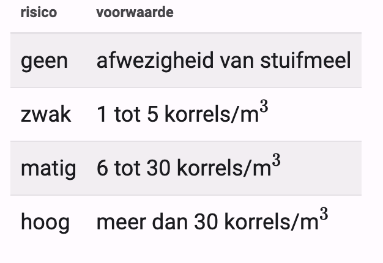

### Opdracht

Elke dag worden in België de hoeveelheid graspollen gemeten en op basis van deze meting wordt er eventueel een waarschuwing gegeven over het risico voor personen die last hebben van een allergie. Afhankelijk van het aantal gemeten korrels stuifmeel wordt het risico hierbij als volgt uitgedrukt:

   

 

Shrijf een geschikte boodschap op het scherm in functie van het aantal korrels stuifmeel.

### Invoer

Het aantal gemeten stuifmeelkorrels per kubieke meter.  

### Uitvoer

Volgende boodschap: "Er is *xxx* risico op allergie bij *n* korrels". Waarbij xxx moet vervangen worden door het risico uit de tabel en n door het aantal korrels dat gegeven is.

### Voorbeeld 1

**Invoer**

    18

**Uitvoer**

    Er is matig risico op allergie bij 18 korrels per kubieke meter.
    
### Voorbeeld 2

**Invoer**

    40

**Uitvoer**

    Er is hoog risico op allergie bij 40 korrels per kubieke meter.
