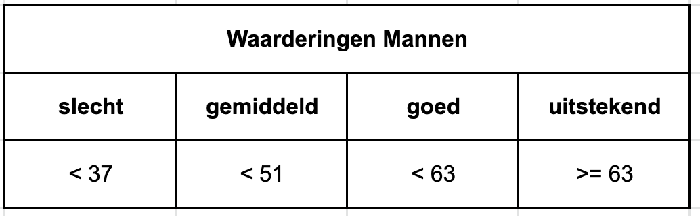
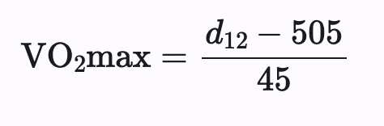

De VO2max of het of het maximale zuurstofopnamevermogen is het maximale volume zuurstof dat het menselijk licdhaam kan transporteren en verwerken.

   

 

Gemiddeld gesproken hebben mannen een VO2max tussen de 35 en 40 ml/kg/min. Topsporters kunnen waarden bereiken die tussen de 60 en 95 ml/kg/min liggen. De VO2max neemt af met de leeftijd.

 
<table>
     <tr>
          <th>

</th>
     </tr>
</table>
 

Een methode om de VO2max te schatten maakt gebruik van de coopertest. Bij de coopertest is het de bedoeling dat je in 12 minuten een zo groot mogelijke afstand aflegt. Met behulp van de afgelegde afstand kan je dan met onderstaande formule de VO2max benaderen.:

   

 

waarbij $$d$$12 de afstand in meter die men aflegt in 12 minuten.

### Opgave

Schrijf een programma dat:

- de afstand $$d$$12 in meter vraagt,
- de VO2max schatting op 1 cijfer na de komma berekent
- en vervolgens de juiste boodschap op het scherm zet afhankelijk van de leeftijd.

### Invoer

- De afstand afgelegd in 12 minuten in meter.

### Uitvoer

Volgende boodschap:  

     Je heb een VO2max van <berekende waarde> ml/kg/min en dus een <waardering> conditie. 
     
Waarbij \<berekende waarde\> vervangen wordt door het resultaat van je berekening afgerond op 1 cijfer na de komma  
en \<waardering\> door de juiste waardering uit de tabel: "slechte", "gemiddelde", "goede" of "uitstekende".

### Voorbeelden

**Invoer**

     2450

**Uitvoer**

     Je hebt een VO2max van 43.2 ml/kg/min en dus een goede conditie.  
     
**Invoer**

     2000

**Uitvoer**

     Je hebt een VO2max van 33.2 ml/kg/min en dus een slechte conditie. 

