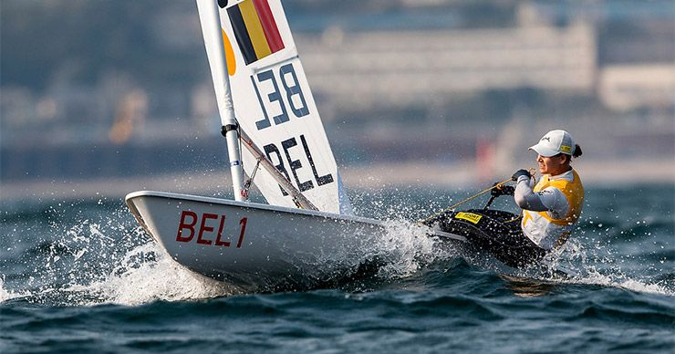

### Opdracht

   

   

### Invoer

Verschillende hoogten en gefaalde pogingen na elkaar. Bij 3 gefaalde pogingen stopt de invoer.

### Uitvoer

* Het aantal keer dat de atleet over de lat is gegaan en het aantal keer dat hij gefaald heeft.
* Verdeel de hoogte tussen 5,00 m en 6,20 m in stukken van 20 cm. Geef per deel van 20 cm aan hoeveel keer hij erover is gegaan.

### Voorbeeld

**Invoer**
    
    5,35
    5,50
    5,60
    X
    5,70
    X
    X
    5,75
    X
    X
    X
    

**Uitvoer**
    
    De atleet is 5 keer over de lat gegaan.
    En hij heeft 6 keer gefaald.
    
    5,00 - 5,19: 0
    5,20 - 5,39: 1
    5,40 - 5,59: 1
    5,60 - 5,79: 3
    5,80 - 5,99: 0
    6,00 - 6,19: 0
    
     
  
   
