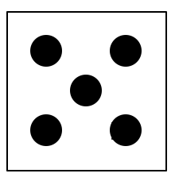

## Opdracht
 

In een bordspel wil je een dobbelsteen tekenen met de turtle-module. Je maakt eerst de buitenkant van de dobbelsteen en daarna de stippen.  
Maak 3 functies aan: één om de turtle te verplaatsen zonder te tekenen, één om een vierkant te tekenen en één om een rondje te tekenen.

### Gegeven

Je gebruikt de `turtle`-module.

Je tekent een dobbelsteen met waarde 5.

### Wat moet je doen?

+ maak een functie die de turtle naar een positie verplaatst zonder te tekenen, gebruik parameters om de positie mee te geven
+ maak een functie die één stip tekent op de opgegeven plaats
+ maak een functie die het vierkant van de dobbelsteen tekent
+ gebruik deze 3 functies om een dobbelsteen met 5 stippen te tekenen

### Verwachte uitvoer

Op het scherm verschijnt een dobbelsteen met waarde 5: een vierkant met vijf stippen op de juiste plaats.

   
    

 
