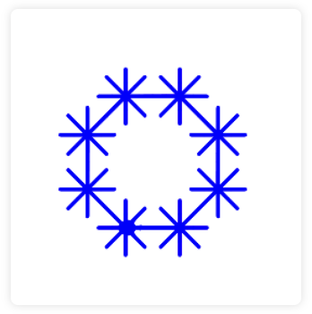

## Opdracht
 

In deze oefening combineer je twee tekeningen met de turtle-module. Je tekent eerst een veelhoek en op elke hoek van die veelhoek komt een sprite. Je maakt gebruik van functies om de veelhoek en de sprites te tekenen.

### Gegeven

De gebruiker geeft in:
- de lengte van een zijde van de veelhoek
- het aantal zijden van de veelhoek

Je maakt:
- een functie `teken_veelhoek`
- een functie `teken_sprite`

De sprite heeft altijd 8 beentjes.  
De lengte van elk beentje is de helft van de lengte van een zijde van de veelhoek.

### Wat moet je doen?

+ maak een functie `teken_sprite` die een sprite met 8 beentjes tekent
+ maak een functie `teken_veelhoek` die een veelhoek tekent
+ vraag de lengte van de zijde en het aantal zijden aan de gebruiker
+ voer de sprite uit op elke hoek van de veelhoek

### Verwachte uitvoer

Op het scherm verschijnt een veelhoek met op elke hoek een sprite.  
Elke sprite heeft 8 beentjes.  
De lengte van elk beentje is de helft van de lengte van een zijde van de veelhoek.

   
    

 
