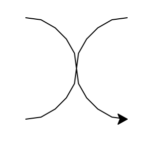

## Opdracht
 

In een tekenprogramma wil je een figuur maken met twee halve cirkels. De halve cirkels moeten horizontaal naast elkaar staan en in tegengestelde richting gebogen zijn.  
De turtle-module is niet beschikbaar in Dodona. Daarom zal je je code in Visual Studio Code moeten schrijven. Als je code af is, kan je ze kopiëren naar Dodona.

### Gegeven

Je gebruikt de `turtle`-module.

### Wat moet je doen?

+ maak een turtle aan
+ teken een eerste halve cirkel
+ teken daarna een tweede halve cirkel die er horizontaal tegen aansluit
+ zorg ervoor dat de tweede halve cirkel in de omgekeerde richting buigt

### Verwachte uitvoer

Op het scherm verschijnt een figuur met twee halve cirkels die horizontaal tegen elkaar staan en elkaars omgekeerde vorm zijn.

### Voorbeeld van uitvoer  
    
    Er verschijnt een liggende golvende vorm met twee halve cirkels.

   
    

 
