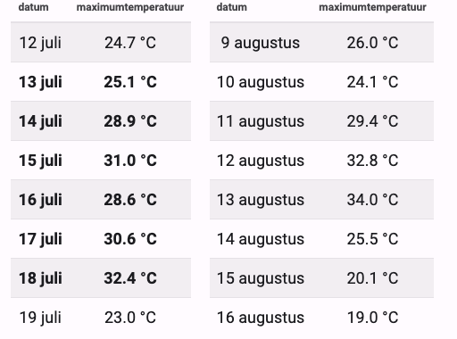

### Opdracht

Een **hittegolf** is een periode die gekenmerkt wordt door uitzonderlijk hoge temperaturen. Wanneer men precies van een hittegolf begint te spreken, hangt echter in sterke mate af van waar men zich op aarde bevindt. Het KMI (België) definiëren een hittegolf bijvoorbeeld als een periode van ten minste vijf opeenvolgende dagen met een maximumtemperatuur van 25 °C of meer (zomerse dagen).  

Hieronder staan twee fictieve voorbeelden van een echte hittegolf (links) en een warme periode die echter niet als hittegolf aangerekend wordt (rechts).

   

### Invoer

Een reeks floating point getallen die elk op een afzonderlijke regel staan. Deze getallen stellen de maximumtemperaturen voor die in een weerhut gemeten werden voor alle opeenvolgende dagen uit een bepaalde periode. De reeks wordt afgesloten door een regel die het woord stop bevat.  

### Uitvoer

De tekst hittegolf als binnen de gegeven periode minstens één hittegolf werd waargenomen volgens de definitie van het KMI, of anders de tekst geen hittegolf.

### Voorbeeld

**Invoer**

    24.7
    25.1
    28.9
    31.0
    28.6
    30.6
    32.4
    23.0
    stop

**Uitvoer**

    hittegolf  
    
    
### Voorbeeld

**Invoer**

    26.0
    24.1
    29.4
    32.8
    34.0
    25.5
    20.1
    19.0
    stop

**Uitvoer**

    geen hittegolf
