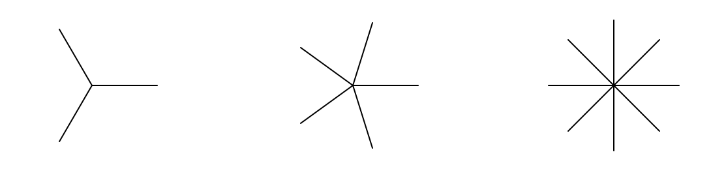

## Opdracht
 

In een digitaal tekenprogramma maak je drie kleine sprites. Een sprite is een figuur met meerdere beentjes die vanuit één middelpunt vertrekken. Je tekent vandaag drie varianten: met 3, 5 en 8 beentjes.
De turtle-module is niet beschikbaar in Dodona. Daarom zal je je code in Visual Studio Code moeten schrijven. Als je code af is, kan je ze kopiëren naar Dodona.

### Gegeven

Je gebruikt de `turtle`-module.

Je maakt een tekening met:
- een sprite met 3 beentjes
- een sprite met 5 beentjes
- een sprite met 8 beentjes

### Wat moet je doen?

+ maak een turtle aan
+ verplaats de turtle zonder te tekenen 200 naar links
+ teken een sprite met 3 beentjes
+ verplaats de turtle zonder te tekenen 200 naar rechts
+ teken een sprite met 5 beentjes
+ verplaats de turtle opnieuw zonder te tekenen 200 naar rechts
+ teken ten slotte een sprite met 8 beentjes

### Verwachte uitvoer

Op het scherm verschijnen drie sprites naast elkaar. De eerste sprite heeft 3 beentjes, de tweede 5 beentjes en de derde 8 beentjes.

### Voorbeeld van uitvoer  
    
    Links staat een sprite met 3 beentjes.
    In het midden staat een sprite met 5 beentjes.
    Rechts staat een sprite met 8 beentjes.

   
    

 

