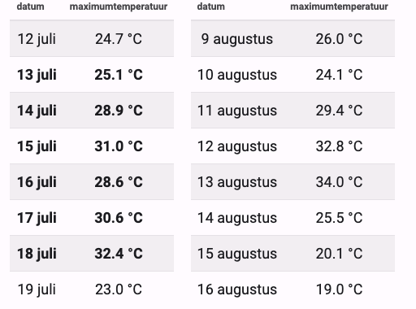

### Opdracht

Een **warme periode** is een periode die gekenmerkt wordt door uitzonderlijk hoge temperaturen. Wanneer men precies van een warme periode begint te spreken, hangt echter in sterke mate af van waar men zich op aarde bevindt. Het KMI (België) definiëren een warme periode bijvoorbeeld als een periode die ten minste vijf dagen met een maximumtemperatuur van 25 °C of meer (zomerse dagen) bevat.  

Hieronder staan twee fictieve voorbeelden van een warme periode.

   

### Invoer

De eerste invoer is het aantal dagen waarvan de temperatuur gegeven is, het aantal temperaturen (regels) die in de invoerreeks staan. 
De volgende invoer is dus een reeks kommagetallen die elk op een afzonderlijke regel staan. Deze getallen stellen de maximumtemperaturen voor die in een weerhut gemeten werden voor alle opeenvolgende dagen uit een bepaalde periode.  

### Uitvoer

De tekst "Dit is een warme periode met als gemiddelde temperatuur <gemiddelde temperatuur> graden." als binnen de gegeven periode vijf warme dagen van 25 °C of meer voorkomen.  
Of anders de tekst "Dit is geen warme periode".

### Voorbeeld

**Invoer**

    8
    24.7
    25.1
    28.9
    31.0
    28.6
    30.6
    32.4
    23.0

**Uitvoer**

    Dit is een warme periode met als gemiddelde temperatuur graden.  
    
    
### Voorbeeld

**Invoer**

    9
    24.9
    24.1
    29.4
    32.8
    34.0
    25.5
    20.1
    19.0
    23.2

**Uitvoer**

    Dit is geen warme periode
