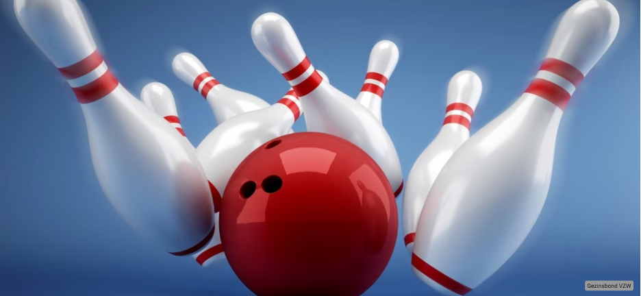

### Opdracht

   

 
  
Bij bowling is het de bedoeling om met een bal op een baan van kunststof of hout de 10 kegels, ook wel pins genoemd, aan de andere kant van de baan om te gooien met een zogenaamde bowlingbal.

### Invoer

Een tekst.

### Uitvoer

Eén string. In de string is de eerste letter van elk woord een hoofdletter.

### Voorbeeld

**Invoer**
    
    Hopelijk is het morgen mooi weer want de schoolweek eindigt vandaag al.

**Uitvoer**
    
    Hopelijk Is Het Morgen Mooi Weer Want De Schoolweek Eindigt Vandaag Al.
    
     
  
   
